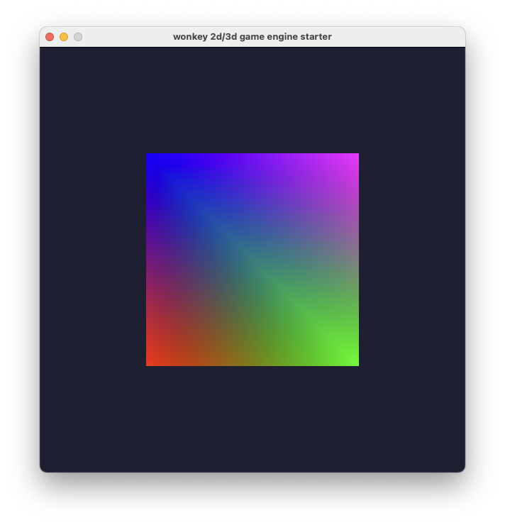

# Wonkey 2d/3d game engine starter

A Wonkey 2d/3D game engine starter project using SDL2 and ANGLE statically linked to a standalone executable.



*For the moment, tested only on MacOS 12.*

## Features

- Standalone executable
- Agnostic graphics renderer using OpenGLES3 API, thanks to ANGLE
    - Linux : OpenGL
    - MacOS : Metal
    - Windows : D3D11
- Cross platforms

## Install

**⚠️ Prerequisite tools installed** : `git`, `cmake`, `ninja`

### Cloning this repo:

```bash
git clone http://github.com/seyhajin/wonkey-game-engine-starter
```

### Install all dependencies:

```
install = setup -> sync -> build -> copy
```

* `setup`: cloning all dependencies into `deps/` directory
* `sync`: ⚠️ This may take a long time, the first time to syncying all dependencies
* `build`: building all dependencies into static libraries
* `copy`: copying headers and libraries into `native/` directory

> NOTE: You must launch all scripts from root project directory.

#### Linux and MacOS

```bash
$ cd wonkey-game-engine-starter
$ ./scripts/install.sh
```

#### Windows

```batch
> cd wonkey-game-engine-starter
> scripts\install.bat
```

## Examples

There are Wonkey and C/C++ versions of `hello` sample in  `src/` directory.

### Wonkey

Open `src/hello.wx` and run it. :)

### C/C++

**⚠️ Prerequisite C/C++ compilers installed**

#### Building

Execute from root project directory.

##### Linux

```bash
$ TODO
```

##### MacOS

```bash
$ clang++ -std=c++14 ./src/hello.cc -o ./src/hello -I./native/include -L./native/lib/macos -DANGLE_EXPORT= -DANGLE_STATIC=1 -DANGLE_UTIL_EXPORT= -DEGLAPI= -DGL_APICALL= -DGL_API= -DKHRONOS_STATIC -lEGL_static -lSDL2 -lm -liconv -pthread -framework Foundation -framework IOKit -framework CoreFoundation -framework CoreGraphics -framework Metal -framework IOSurface -framework QuartzCore -framework Cocoa -framework GameController -framework CoreAudio -framework AudioToolbox -framework CoreHaptics -framework ForceFeedback -framework Carbon -framework AVFoundation
```

##### Windows

```batch
> TODO
```

## Dependencies

- [sdl2](https://github.com/libsdl-org/SDL)
- [angle](https://github.com/google/angle)
